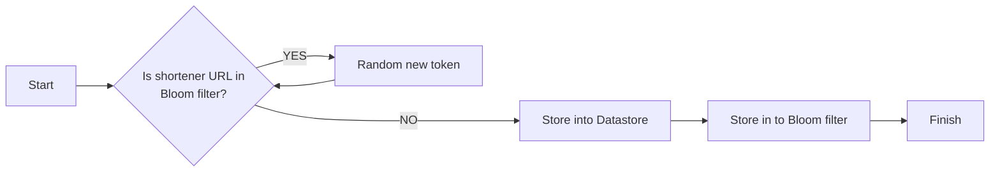
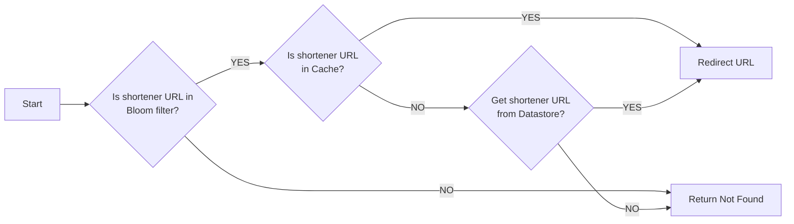

# URL shortener

An URL shortener using Go programming language.

## API document

👉 [API document](./doc/API.md)

## Local Development

You need setup environment first.
The postgres and redis will be running on docker.

```shell
make env
```

or

```shell
docker-compose -p url_shortener -f ./deployments/environment/docker-compose.dev.yaml up -d
```

## How To Deploy

using docker deploy

```shell
make docker-deploy
```

This command will auto run docker build and run docker compose.
after this command done need create sql schema.

You can use this db [migrate tool](https://github.com/pressly/goose)-goose or create sql schema by manual.
If you want to create sql schema, Please see project folder *./deployments/migrate/20230630113828_init.sql*

If using goose, Please run this command

```shell
make goose
```

**Notice** The app config will adopt `deployments/config/app.dev.yaml` when using docker deploy.

## Design Concept

Analyze URL shortener system requirement，There's two key point. One is how to create short url id and How to handle many
clients access shorten URL simultaneously or
try to access with non-existent shorten URL, please take performance into account。

### How to create short url id?

We can use random token solution or snowflake to create shorten url id. In this case I chose random token solution
because is spent less resource and using snowflake need config key
generator server. It will make system complex.

After trade off I chose random token and bloom filter to handle this system.
Use bloom filter can quickly check token is existed. If token exist then just create new one.

Create Shorten URL flow



### How to handle many clients access shorten URL simultaneously?

First layer use Redis Bloom filter.

The bloom filter has lower space complexity and time complexity is O(k), where k
is the number of hash functions used by the last sub-filter. The feature can quickly check short url is existed and
reduce access database count.

Second layer use local cache.
Why not using redis ? This case shorten url data must be immutable.
Use local cache can reduce connect to redis network io

Redirect flow



### TODO

The database can choose NoSQL. According Shoten url data scheme not have complex query or relation.
Using NoSQL such as DynamoDB or MongoDB is better than Relational database.

e.g:

1. The NoSQL database get data cloud be faster.
2. The DynamoDB provider TTL feature. When shorten url is expired can use this feature to prevent scan all expire data.

### 3rd party lib using

Pick a few interesting ones to talk about.

1. [github.com/coocood/freecache](github.com/coocood/freecach)
    - Store hundreds of millions of entries
    - Provide zero GC
    - High concurrent thread-safe access
2. [github.com/pkg/errors](github.com/pkg/errors)
    - Extend golang error with stack
3. [github.com/redis/go-redis](github.com/redis/go-redis)
    - [Redis official recommend lib](https://redis.io/resources/clients/#go)
    - thread-safe
    - Friendly API use
4. [github.com/rs/zerolog](github.com/rs/zerolog)
    - Blazing fast
    - Low to zero allocation