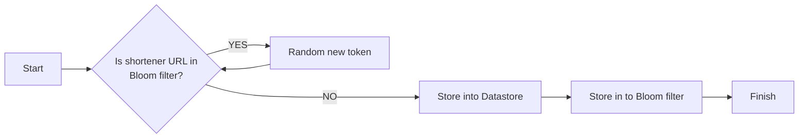
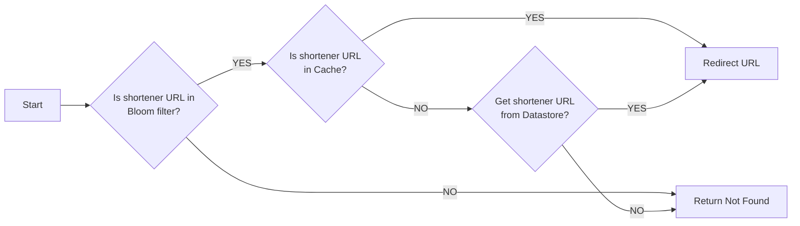

# URL shortener

An URL shortener using Go programming language.

## API document

👉 [API document](./doc/API.md)

## Local Development

Need to set up environment first.
The application service depend on PostgreSQL and Redis.

Provide the docker compose file to set up environment.
You can run makefile or create environment by manual

```shell
make env
```

or

```shell
docker-compose -p url_shortener -f ./deployments/environment/docker-compose.dev.yaml up -d
```

Also, this project use this db [migrate tool](https://github.com/pressly/goose)-goose to manage database schema.

If using goose, Please run this command.

```shell
make goose
```

**Notice** This project repository test requires a real database. Before running the repository layer unit testing,
please set up the environment.

## How To Deploy

Provide Docker Compose Deploy

```shell
make docker-deploy
```

This command will auto run docker build and run docker compose and auto create sql schema.
The docker compose file is `deployments/environment/docker-compose.yaml`

**Notice** The app config will adopt `deployments/config/app.dev.yaml` when using docker deploy. If you want to change
http
server port, please update serverHost in app.dev.yaml

## Design Concept

Analyzing the system requirements for a URL shortener, there are two key points:

1. How to generate short URL IDs.
2. How to handle simultaneous access to shortened URLs from multiple clients, as well as attempts to access non-existent
   shortened URLs.

### How to generate short url id?

We can use a random token solution or Snowflake to create shorten url id. In this case I have chosen the random token
solution
because it consumes fewer resources. Using snowflake require to config key
generator server which would make the system more complex and need maintain key generator server.

After trade off, have decided to use a combination of random tokens and a Bloom filter to handle this system.
Use bloom filter allows for quick verification of token existence. If a token already exists, a new one can be
generated.

**Bloom filter false positive**
The random token solution should check key collision issues. You will curios bloom filter false positive. Should I hande
it?
In my opinion we can ignore false positive. Because we want unique id then just share the short url is not exist.

Consider key collision, the system need key generator server pre generator some keys when high concurrency case to
reduce create keys time.

Generate Shorten URL flow



### How to handle many clients access shorten URL simultaneously?

The first layer utilizes a Redis Bloom filter. The Bloom filter offers a lower space complexity and a time complexity of
O(k), where k represents the number of hash functions used by the last sub-filter. This feature enables quick
verification of the existence of a shortened URL and reduce access database.

Second layer use local cache.

**Why not using redis?**

In this case, the data for shortened URLs must remain immutable.
Use local cache then we don't connect to redis.The reason is saves on network I/O and connection time.

Also, the system has weak point, It will a lot of request access database when short url not cacheing.
Maybe we can count which short url is hot data, then warn cache to prevent too many request access database.
Additional optimize the system, maybe we can collapse the requests and will forward a single request to the origin
server.

Redirect flow



### TODO

The database can choose NoSQL. According Shoten url data scheme not have complex query or relationships,
using NoSQL such as DynamoDB or MongoDB is better suitable than a relational database..

for example:

1. The NoSQL database get data will be faster.
2. The DynamoDB provider TTL feature. When shorten url is expired can use this feature to prevent scan all expire data.

### 3rd party lib using

Pick a few interesting ones to talk about.

1. [github.com/coocood/freecache](github.com/coocood/freecach)
    - Store hundreds of millions of entries
    - Provide zero GC
    - High concurrent thread-safe access
2. [github.com/pkg/errors](github.com/pkg/errors)
    - Extend golang error with stack
3. [github.com/redis/go-redis](github.com/redis/go-redis)
    - [Redis official recommend lib](https://redis.io/resources/clients/#go)
    - Thread-safe
    - Friendly API use
4. [github.com/rs/zerolog](github.com/rs/zerolog)
    - Blazing fast
    - Low to zero allocation